# Using convolutional neural networks to understand magnetism in two-dimensional structures based on Cr2Ge2Te6

## Introduction

Over the past decade, two-dimensional materials have demonstrated immense potential for creating advances in fundamental research and industrial applications. In particular, experimental and computational studies of the transition-metal based compounds [1,2] both highlight the emergence of numerous magnetic phases in two-dimensional crystals. These findings have sparked significant excitement in materials science for their potential use in data storage and spintronics applications. A notable example of this is Cr2Ge2Te6 which was recently experimentally shown to exhibit ferromagnetism [3]. Despite these experimental observations and our general understanding of how magnetism arises in bulk crystals, we have yet to fully understand the specific mechanisms through which magnetism arises in these two-dimensional (2-D) materials. Developing this understanding could significantly impact our ability to accurately predict the magnetic properties of novel materials - designed by decorating atomic sites of known 2-D structures with different atoms (see fig. 1). In addition, this understanding could strengthen our ability to engineer materials for specific device applications. 

 
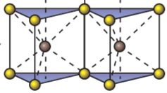

Figure 1. Monolayer structure of a Transition Metal Dichalcogenide in the 2H phase where yellow spheres represent chalcogens and black spheres represent metals. By decorating these lattice sites with different atoms from the periodic table, we can develop a large space of testable '2-D' materials (adapted from Qing Hua Wang et al [4]) 

For many years research groups have focused on improving density functional theory (DFT) calculations to capture such properties [5,6]. Yet these methods tend to be computationally and financially costly. Machine learning (ML) is rapidly paving the way to accurate property predictions in a much faster and cost-effective manner [7]. In addition, ML tools create avenues through which we can develop a better understanding of the properties themselves. For example, Pilania et.al have shown that machine learning methods can be used to accurately model bandgaps of double perovskites [8]. Furthermore, ML methods have also been shown to capture an understanding of the underlying physics in layers of a Neural Network trained to reproduce DFT results [9]. Given this, we decided to build a convolutional neural network architecture to develop a better understanding of magnetism in transition metal trichalcogenides(see fig. 2). Initial results show promise for being able to identify patterns linked to fluctuations in spin density across lattice sites. However, the microscopic origins of magnetism in these density profiles have not yet been identified through this approach.

 
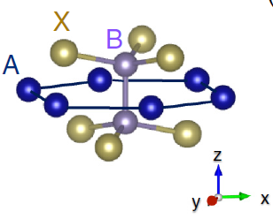

Figure 2. ABX3 structure of a transition metal trichalcogenide. 'A' sites represent Transition Metals, 'B' sites typically represent group 4 and 5 atoms and 'X' sites represent the chalcogens (group 6). 

## Background

### Magnetism

At present we know that magnetism in materials arises because of the quantum nature of electrons [10]. Specifically, we know that the net magnetic moment (J) of a single atom is:

 
J=L±S

Where L is the orbital angular momentum of the electron around the nucleus and S is the intrinsic spin angular momentum of the electron. When many atoms are placed next to each other in a crystalline structure, it is possible for electrons in the atomic orbitals to overlap and adhere to the Pauli exclusion principle (which states that two or more identical fermions cannot occupy the same quantum state within a quantum system). As a consequence, the spins can order in a particular manner, for instance they can align in either parallel or anti-parallel configurations and as such give rise to different magnetic properties. These spin orderings can be mathematically modeled using the Heisenberg model in which a spin operator J acts on nearest-neighbor coupled spins. Since we deal with TMTC's which are in a honeycomb lattice, the resulting model is:

 
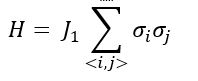

In which σi is the spin of one of the atomic electrons and J1 is the interaction term that tells us how the spins of nearest neighbor atoms interact. Typically, interactions between 2nd and 3rd nearest neighbor sites are neglected because the J1 term is dominant in bulk crystals. However, Sivadas et al  showed that by adding J2 and J3 interaction terms into the Hamiltonian for 2-D materials (second and third nearest neighbor interactions), they were able to obtain results that agreed better with experiment [11]. Their resulting Heisenberg model is:

 
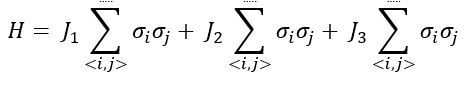

Furthermore, they visually illustrate [FIG 3] how these interactions could take place.

 
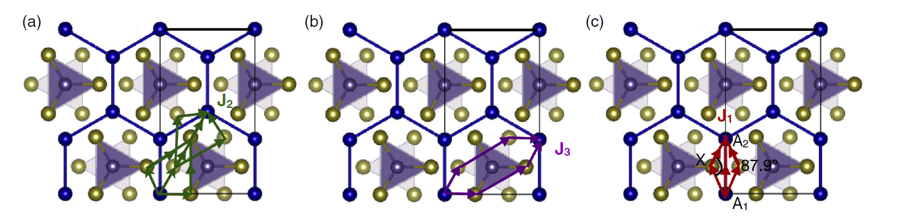

Figure 3. 3 pathways presented for Nearest Neighbor exchange. a) represents the second nearest neighbor, b) the third and c) the first (direct exchange-vertical and superexchange- 87.9 angle). Adapted from Sivadas et al [11] 

These results inspired us to ask the following question: can we find evidence of exchange interactions (patterns) by analyzing the spin density profiles (images) of 2-D materials? One natural approach for this was to use a convolutional neural network (CNN). 

### Convolutional Neural Networks

A Convolutional Neural Network is an ML algorithm which takes images as inputs and then convolves these images with 'filters' to produce outputs which can be pooled/flattened or used to make a decision. An example architecture is highlighted in fig. 4.

 
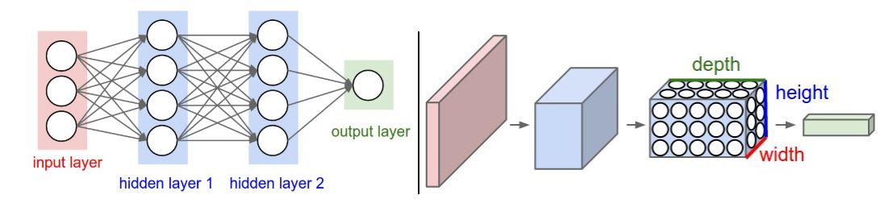

Figure 4. Left: A regular 3-layer Neural Network. Right: A convolutional net arranges its neurons in three dimensions, as visualized in one of the layers. Every layer of a CNN transforms the 3-D input volume to a 3-D output volume of neuron activations. In this example, the red input layer holds the image, so itds width and height would be the dimensions of the image and the depth would be 3 (Red,Green,Blue channels). Note: We can add an additional dimension for 4-D information (e.g. figures in x,y and z with a channels parameter). Adapted from Stanford CS231n [12] 

CNN’s have been used quite successfully for pattern recognition in images. For example, CNN’s trained on human faces were shown to detect facial characteristics within their filters [13]. Given this, we thought CNN’s would be a great way to detect patterns manifested by exchange interactions in large images (electron density profiles).

## Methodology

### Data 
We used DFT to build a database of structures based on Cr2Ge2Te6. Our motivation in doing so was to replace the individual sites by different atoms so that we could obtain variations in the spin densities and magnetic order for training the ML model. We did this by replacing one of two chromium atoms (A sites) in unit cells with a transition metal. We restricted the transition metals to (Ti,V,Cr,Mn,Fe,Co,Ni,Cu,Y,Nb,Ru) in order to comprise most of the first row of TM’s and a few of the second. Substitutions for B were Ge,Ge0.5Si0.5,Ge0.5P0.5,Si and P. X sites were decorated with S, Se or Te. (Alternatively, see the table x).

	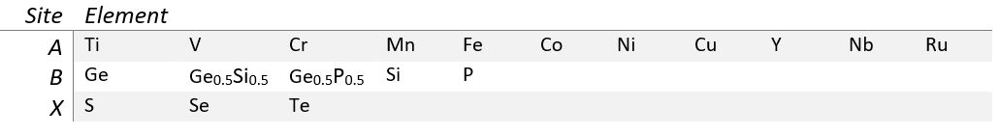

	Table 1. List of elements used at each of the TMTC sites.

For each composite, DFT total energies of the relaxed structures were calculated for several initial spin configurations: non-spin polarized, ferromagnetic and Neel antiferromagnetic. The resultant spin density profiles (60X60X120 images (see fig. 5) contain information relevent to magnetism and thus served as input to our ML models. 

 

Figure 5. Left: unit cell of Cr2Ge2Te6 (in the x-y plane) with spin density isosurfaces overlaid at charge values of 7.3e-5. The yellow surfaces are positive densities and the blue are negative. Blue spheres represent Chromium sites, purple spheres represent Germanium and yellow sphere represent Tellerium. Right: average projection of charge densities in the x-y plane.  

To begin our investigation, we used the FM spin configuration which comprise mixing of all the A and B sites shown in Table 1 with X = Te. We also needed a target (response) variable and decided to use magnetic moment as a means for classification. For our initial model we chose 4 Bohr magnetons (the mean of our distribution) as a splitting criterion for training a classification model (see fig 6). Note, our 3-D charge densities are handled easily by the python Neural Network packages, keras and tensorflow. 
 

 
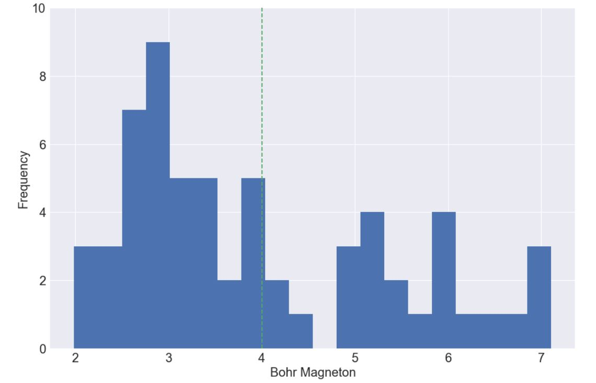

 Figure 6. Distribution of response variables appears to illustrate mixture of two gaussians. As such, we use the mean, highlighted in green, as the splitting criteria which leads to 37 values below 4 Bohr magnetons and 25 above.  

### Architecture Design

One big challenge with using Convolutional Neural Networks is that they have many parameters and can be quite complex. To tackle this problem in a systematic way we decided to think more closely about what convolutions were doing to our input image and what we were hoping to extract. Here we outline some of our preliminary design decisions:
1. We wanted to start out with a simple model and then tune parameters accordingly. As such, we decided our model would simply have one convolutional layer, one pooling layer and one flatten/dense layer. 
2. Since we were hoping to find 3 nearest neighbor exchange interactions, we designed our first convolutional layer to have 3 filters. We later varied the number of filters to get a sense for the kind of variations in patterns recognized (see results).
3. A large kernel size of (40X40X40) was initially chosen because this would force the CNN filters to learn larger atomic-distance patterns. It must be noted that smaller kernels underfit because of significant data compression and larger kernels overfit due to no compression. As such one needs to cross validate to find the right size with the constraint here that they shouldn’t be too small since this could result in a non-interpretable model.
4. Our model is looking for nearest neighbor exchange patterns which occur on length scales the order of atomic distances. Therefore, we used a 2X2 supercell to create the spin density profiles.Thus, filters could scan over and detect these ‘long’ range interactions.
5. Strides for the convolutional layers were varied across experimental runs because we had little prior knowledge for what they should be set at. We do know that small strides mean more information encoded in our layers, but this also means more computation. Accounting for this trade-off we tried numerous strides to see whether they would influence performance.
6. A relu activation unit was used to prevent the zeroing out of filter weights.
7. A pool size of (2X2X2) was chosen so that additional convolutional layers could be added later since larger pool sizes mean significant shrinkage.
8. A flatten layer was used with a dense layer of size 2 and a softmax for classification since there are only 2 categories.
9. We decided to use stochastic gradient descent (SGD) since it prevents us from getting stuck in local minima. A learning rate which determines the rate at which we try to find minima was set and then varied across the trials to determine the best rate in our validation set. The choice of batch size (number of datapoints to find an SGD gradient on) significantly affects our ability to get to the local minima but large batch sizes tend to be memory intensive. 
10. Most convolutional nets have a channels parameter which is usually meant to reflect different colors (e.g.  rgb) or different types of the same image. Our spin densities naturally fit into the black and white color scheme since some densities were negative and others were positive. We therefore divided the data accordingly. A train test split of 70-30% was used and 5 Epochs were run.

### Computation and Memory
Convolutional Networks require significant computation and memory to run. While our initial model was simple, it ran in about 15 minutes on a new i-7 laptop. Scaling such a problem to higher dimensions was clearly going to be an issue from that perspective. Furthermore, the memory requirements for such a framework are governed by the number of weights needed for each filter and the actual output of the filters. A class at Stanford details how to do the memory calculation and we carried it out for our own system, see the benchmarking excel sheet on github. From this analysis it was clear that although we needed roughly 500mb for our architecture, extra system memory on a cluster meant that we needed > 2Gb. With this, we converted our system to use two GPU's for both training and evaluation, this brought down our system run times drastically and helped us scale our problem. For reference, a simple architecture which ran one epoch took 7 minutes on a relatively new computer and took 8 seconds on a single GPU.

## Results

Since these are only our preliminary results, we segment them according to the various parameters we swept over. To do this we needed to define a base model. Using the parameters discussed previously we use the following as our base model:

 
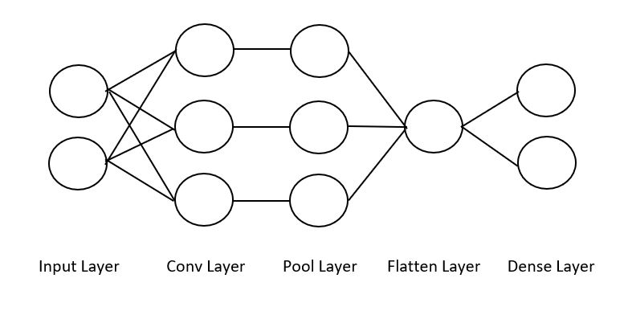

##### Parameters
Number of Convolutions: 1

Number of filters: 3

Filter Size: (40,40,40)

Stride: (1,1,1)

Pool Size: (2,2,2)

Learning Rate: 100

Batch Size: 20

Train/Test: 0.7/0.3

Channels: 2

Input Shape: (120X120X120X2) (x,y,z,channels)

Dense Layer: 2

With the given parameters, we swept over multiple filters and filter sizes to search for a model with a high validation accuracy and features that showed patterns. We realized that the most interpretable features were extractable at larger learning rates and we can see this here:

 

 
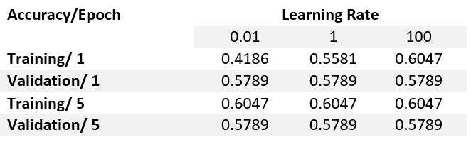

 
Figure 7. The figures illustrate the first filter averaged along the x dimension from three different models in which the left most one had a learning rate of 0.01, the middle had 1 and the right one had 100. The table shows training and validation accuracies for the first and last epoch for each model.

Given that a high learning rate led to good accuracies and an interpretable filter, we ran numerous test which we hihglight below.

### Varying # of kernels

 
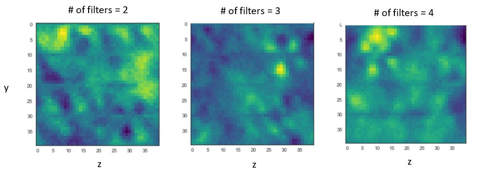

 
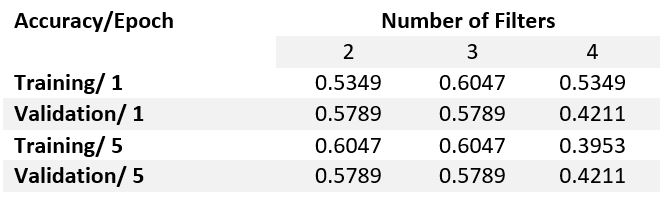

 
Figure 8. 

### Varying pool size

 
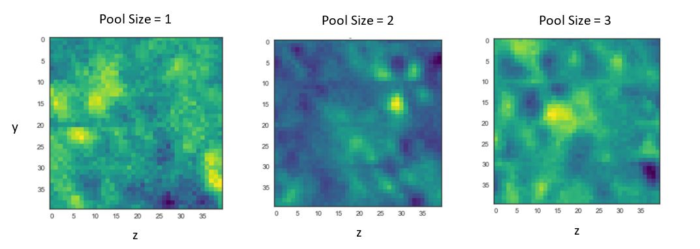

 
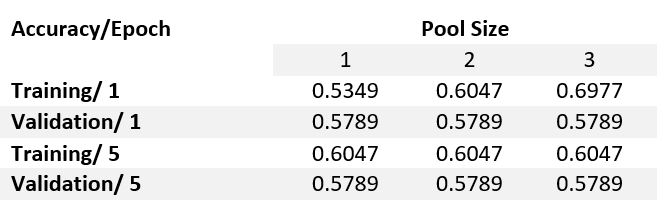

 
Figure 9. 

### Varying learning rate

 
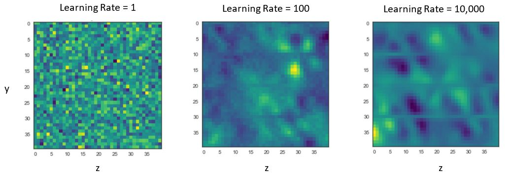

 
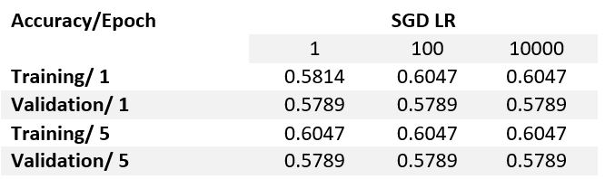

 
Figure 10.

From these results we can see that 3 filters with a pool size of 2 and learning rate of 100 do a decent job in terms of validation accuracy within the first epoch. Note: this is simply one set of parameters in the entire feature space. Ideally, if we had enough time we would loop over an entire grid of parameters to understand the full surface. Furthermore, the filters in this configuration (all the middle figures) illustrate a recognizable pattern in the top right corner(see fig. 11). This pattern actually appears to resemble the isosurface charge density outlines in figure 5. Furthermore, this pattern also matches the shape of p and d orbitals (see appendix). Initial results are highly encouraging. They suggest that we may be able to learn features linking the spin density profile to the mechanisms for magnetic order. 

 
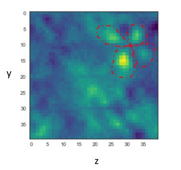

 
Figure 11. Consistent identifiable pattern highlighted in red. Pattern is seen consistenlty across numerous parameters and indicates potential to uncover microscopic origins of magnetism.

## Future Investigation

We believe there are a number of steps to take moving forward that could significantly impact our ability to understand magnetism in these materials rapidly.

- We need to think more carefully about our inputs and outputs:
	- inputs: we are currently feeding in an entire charge density profile, but maybe we can learn better by compressing this data to certain isosurfaces. 
	- outputs: we used a 4 Bohr magneton splitting criteria but what we should ideally do is define a unique classifier (e.g. the magnetic order of the compound).

- Parameter sweep: At present we are limiting ourselves to specific sections of the entire domain of possible combinations of parameters for the purposes of computation but one great way to tackle this challenge is to randomly sample points in this high dimensional space. For example, in table one we can sample 1 of 4 number of filters and combine that with 1 of 30 filter sizes and so on. The table values are simply placeholders and give a sense for some of the parameter ranges that were considered.

 
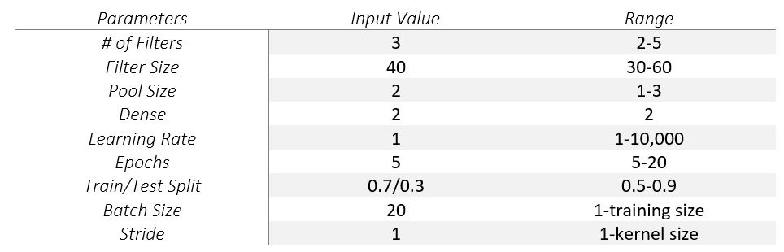

 
Table 2. An outline of the base model on the left and potential ranges of parameters on the right. Randomly sampling from this space may be significantly better than sequential sampling for both computation and accuracy. 

- More convolutions: It is often noticed that additional convolutional layers lead to increased performance. This means that there is a possibility that higher order terms and features are captured by these additional convolutional layers. This may be an important consideration in building our architecture and testing it. A quick run of the algorithm with 2 convolutional layers showed non-interpretable features and no improvement in score but this needs to be investigated thoroughly with better inputs/outputs.

## Conclusion

Initial efforts to extract patterns from spin density profiles of 2-D FM materials show great promise. Patterns learned from smaller filters appear to describe atomic orbitals. Further investigation using this framework may lead to a deeper understanding of the microscopic origins of magnetism in two-dimensions.

## References
[1] M.A. McGuire, H. Dixit, V.R. Cooper, and B. C. Sales, Chem.Mater. 27, 612 (2015)

[2] Y. Takano, N. Arai, A. Arai, Y. Takahashi, K. Takase, and K. Sekizawa, J. Magn. Magn. Mater. 272, E593 (2004)

[3] Gong. Cheng, Li. Lin, Li. Zhenglu et al, Nature 546, 265-269 (2017)

[4] Q.H. Wang et al. Nature-Nanotechnology 7, 699 (2012)

[5] Shi. Xinying, Huang. Zhongjia, Huttula, Marko, Li. Taohai, Li. Suya, Wang. Xiao, Luo. Youhua, Zhang. Meng, Cao. Wei, MDPI. Crystals 8(1), 24 (2018)

[6] Li. Jiao, Fan. Xinyu, Wei. Yanpei, and Chen. Gang. Nature Sci. Rep. 6, 31840 (2016)

[7] Hegde. Ganesh, and B. R. Chris. Nature Sci. Rep. 7, 42669 (2017)

[8] Pilania. G, A. Mannodi-Kanakkithodi, B.P. Uberuagu, R. Ramprasad, J.E.Gubernatis, and T. Lookman. Nature Sci.Rep. 6, 19375 (2016)

[9] E.D. Cubuk, M.D. Brad, O. Berk, W. Amos, E. Kaxiras. J. Chem. Phys. 147, 024104 (2017)

[10] J. M. D. Coey. Cambridge Press. 9780521816144 (2009)

[11] N. Sivadas, M.W. Daniels, R.H.Swendsen,S.Okamoto, and D.Xiao. J. Phys. Rev. B. 91, 235425 (2015)

[12] http://cs231n.github.io/convolutional-networks/

[13] M. Delakis and C. Garcia. http://citeseerx.ist.psu.edu/viewdoc/download?doi=10.1.1.6.697&rep=rep1&type=pdf

## Appendix 

### A.1

A figure illustrating the shape of s,p and d orbitals. These appear to be captured by our convolutional network.

 
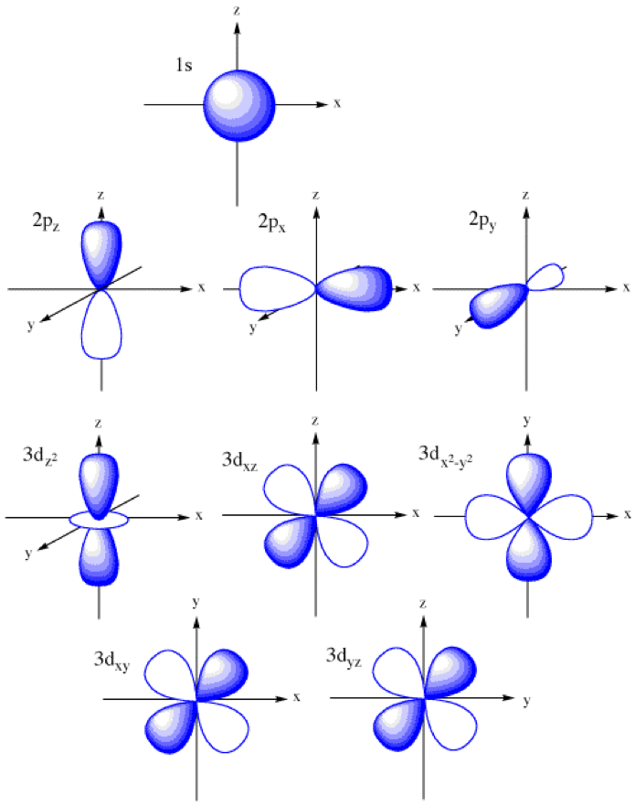

## Code+Workflow

The code in this repo allows you to run a Convolutional Neural Network with 3D charge density profiles as input. The code is configured to run both locally and on Harvard FAS RC GPU's.

<b>Workflow</b>

1. Pull all composite DFT calculations into one folder using chgcar.py when collecting data from the supercomputer that runs DFT calcs.
2. Run magdensity splitter on CHGCAR files to split (spin up + spin down) from (spin up - spin down) and store the latter in a magnetic densities folder.
3. Run the scraper notebook to save the magnetic densities and response variable (magnetic moment) into a large dataframe.
4. To run the convolution locally use the notebook, it basically configures a simple 2/3D convolution of the inputs and is a great way to test whether you have the right files. Make sure the convolutions have small filter sizes (e.g. 5,5,5) since larger weights require a lot of memory and CPU's aren't good for this. 
5. You can play with the architecture and will soon realize the code runs very slowly (especially if using Conv3D), as such we need to run this on GPU's:

<i>Instructions to get setup using a GPU</i>

Guide to Using Odyssey
The following instructions should serve as a preliminary guide to installing the modules needed to run a keras+tensorflow backend python script on a SLURM node. If you know this well, skip to the next section.

General Workflow: [PLEASE READ IF YOU DON'T KNOW ODYSSEY WELL]
Step 1. Request an rc.fas.harvard.edu account from FASRC

Step 2. Once your account is created you will be sent an e-mail to create a password for the account.

Step 3. After all of this you will need to set up the 2 factor authentication (verification code) by either downloading google authenticator onto your phone or the necessary program on your laptop. This is a 6 digit code generator in time. Look up the FASRC website on detailed instructions.

Step 4. If you are using linux login by: ssh [yourusername]@odyssey.rc.fas.harvard.edu, when prompted enter your password and verification code. If you are using windows - download putty or the ubuntu subsystem. Both will let you ssh into the login node.

Step 5. Once you are logged in, you are at a login node. DO NOT RUN YOUR SCRIPTS ON THIS NODE! The FAS software is designed to kill any scripts that run on this node. This node is meant to be where you 'download' the necessary software to run your scripts/handle your scripts.

NOTES [IMPORTANT] - Read these notes carefully because they clarify how the system operates.

Memory: the login node has 100gb of data, you can copy files to it by using scp in linux or using 'filezilla' on windows. If you require more space, look up /scratch.
 
Running Scripts: SLURM is a resource manager, it basically knows how to allocate the right resources to run the necessary scripts. There are 2 main ways to run your code:

 
SBATCH - you send a job to slurm to handle the work for you, this means including a .sh file and specifying all the necessary commands e.g. number of processors etc. It is batch processing and non-blocking.
 
SRUN - an interactive script meaning you cannot write commands while it is run (think of this as a way to 'login' to one of the compute nodes and then run your code on it)
 
Libraries/Modules: In many cases you will need compilers/python/ and other libraries to run your code which are NOT automatically loaded onto the nodes and which cannot be installed using 'sudo apt install'. Many of the commonly used software has been packaged into 'modules' on the FAS RC system. This means you can load them into your environment by running module load MODULENAME. A list of all the modules can be seen by running module list.
 
Environments: When you run a script with sbatch/srun you are doing so in your 'home' environment (the environment of your local directory which is your login node). This means that any installations or modules loaded will be exported with your scripts to the actual 'compute nodes'. For example, if i use <module load python4.0-fasrc01> on my login node, then this is the python version that will run on my job. Sometimes you might want to run different versions of python/work with different libraries- the best way to do this is to create a conda environment. Each conda environment can be thought of as an isolated unit with its own libraries and functions which allows you to install (via pip) the libraries you want without influencing other programs. see RC for how to create a conda environment.

Step 7. Now that you know how the system operates you can load the modules you need and run the scripts you'd like. See the RC website for examples of both sbatch and srun code. 

Keras+Tensorflow Backend on GPU: SRUN version

Here I detail how to run tester.py - a keras CNN on the MNIST dataset.

Step 1. Ask me for the tester.py script.

Step 2. login to odyssey.

Step 3. copy tester.py onto the node using scp(linux)

Step 4. module load the python version you are interested in and create a conda environment using:

conda create -n Keras --clone $PYTHON_HOME

where -n means new and Keras is the name of the environment ( you can name it something convenient)

Step 4. use the following command  to request a number of gpus/cpus:

srun --pty --mem 4000 --gres gpu:1 -t 0-1:00 -p gpu /bin/bash
--pty: makes srun give you a terminal environment
--mem: specifies the amount of memory needed on the node
--gres: refers to general resource with gpu:n where n specifies number of GPU's
-t: the time needed on the nodes
 
Step 5. once you are onto the supermicgpu01, run a module load:

module load gcc/4.9.3-fasrc01 cuda/7.5-fasrc02 tensorflow/1.0.0-fasrc02

which loads a gcc compiler and the cuda environment which will run the tensorflow code on a GPU.

Step 6. run 'source activate Keras' to go into the Keras conda environment

Step 7. run 'pip install Keras'

Step 8. run 'python tester.py' and you should see the program running. Epochs should run for an avg of 13seconds on a single GPU node.

Resources:
https://portal.rc.fas.harvard.edu/apps/modules/Keras
https://www.rc.fas.harvard.edu/resources/documentation/gpgpu-computing-on-odyssey/

### Running cnn_largep.py and our model on GPU's

Step 1: login in to a node
Step 2: create a python 3.6 environment (needed for the keras version we use) by:

conda create -n myenv python=3.6

where myenv is the name of the environment

Step 3: install keras in myenv using:

source activate myenv

pip install keras

Step 4: Two ways to launch our code, srun and sbatch. I outline the srun way but the sbatch way code is also provided

type:

srun --pty --mem 1000 --gres=gpu:2 -p gpu /bin/bash

Step 5: load the tensorflow modules which are compatible with python 3.6

module load gcc/4.8.2-fasrc01 cuda/7.5-fasrc02 tensorflow/1.3.0-fasrc01

Step 6:

source activate myenv

python cnn_largep.py

To do this in sbatch, simply look at cnn_largep.batch which loads all modules for you. Simply carry out steps 1 through 3 and then type:

sbatch cnn_largep.batch

You should now be ready to run our CNN. Configure the CNN in CNN.py to your liking and download a file called chgd_input which is linked here: https://www.dropbox.com/s/iquhjkpvhz7c7g6/chgdf_input?dl=0 into the same directory into your local node on Odyssey. Also download cnn.batch and configure the filenames you want to store. Once done, simply run <sbatch cnn.batch>. The great thing about sbatch is that you can edit your file, run an sbatch, and then repeat. It allows you to change variables in your local node and send jobs with the new parameters to worker nodes.

See the benchmarking excel sheet of the different configurations already run and results I can provide. Seems like larger learning rates are better.

6. After running your code, you can copy the h5 file output into your local machine and run visualizer.ipynb which will let you see projections of your filter.

# Code Descriptions

preproc+visualizer:
chgcar.py - scrapes spin density data into a folder on a cluster
magdensity_splitter.ipynb - splits charge densites and keeps relevant one
scraper.ipynb - converts chgcar to dataframe and determines response
newscraper.ipynb - (assumes you used the above code to convert chgcar to dataframes and didn't do anything to response) this will create AFM/FM response and save it as a main dataframe.

Scripts/Original:
CNN.ipynb/CNN.py - simply run a 3D convolutional net on the bohr magneton data as response, there is no GPU training.
cnn_large.py - converts the 60X60 grids to NX60XNX60 grids to allow for larger filters
cnn_largep.py - the above script with multi gpu module that lets us train on multiple GPU's

.batch files are used to simply submit jobs

Scripts/new_data:
cnn_new_data.ipynb - code to run the new dataset which is larger and in which the response is AFM/FM. Does not include parallelization component (its 2 lines of code which you can copy from cnn_largep.py).

<b>Notes on Architecture</b>

- The point of running this model is to be able to capture patterns in the spin density that arises from nearest neighbor exchange interactions. Note that Sivadas et al show that these occur on the order of atomic lengths which means we should probably scale our unit cell to a supercell (done in cnn_largep.py in function matmul) as well as increase our filter sizes to greater than 60 in each dimension.
- We need to think carefully about the classification model we are building. At present, in the original folder we are classifying composites as 1's if they have a bohr magneton > 4. However, this cutoff was determined using a histogram. In the new_data folder we are using a classification of 1's for AFM and 0's for FM.
- At present we believe we should have 3 filters because this is consistent with Sivadas et al and the number of patterns they present, however, it might be the case that more are needed to capture superexchange.
- Need to figure out how to get granularity.
- Need to understand why a large learning rate yields a more interpretable pattern.
- Need more data

Links for Data:

chgdf_input : https://www.dropbox.com/s/iquhjkpvhz7c7g6/chgdf_input?dl=0

chgdf_new_input : https://www.dropbox.com/s/s5qygz96h98zr1o/chgdf_new_input?dl=0
