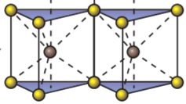
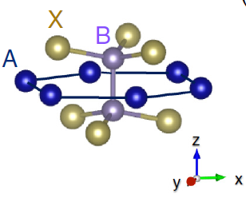
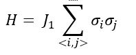
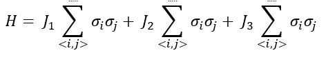
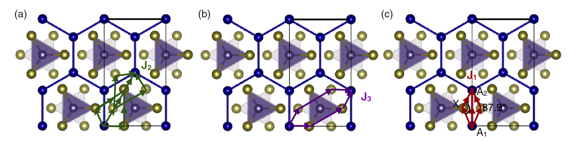
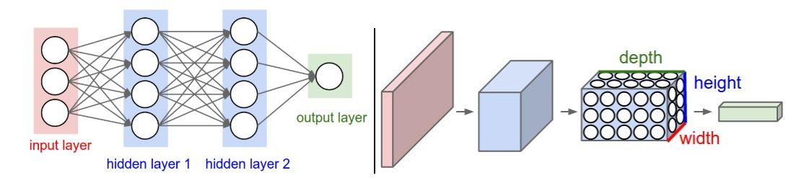
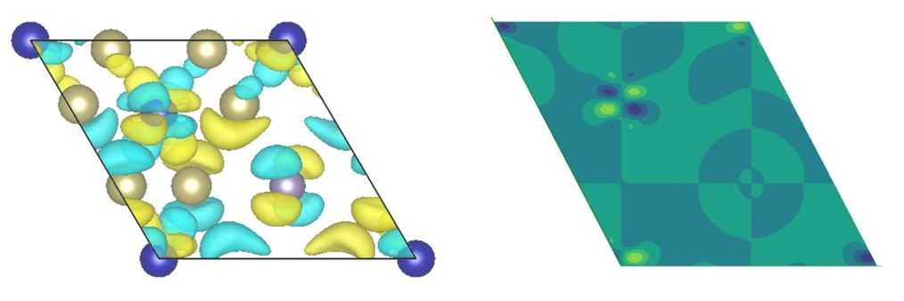
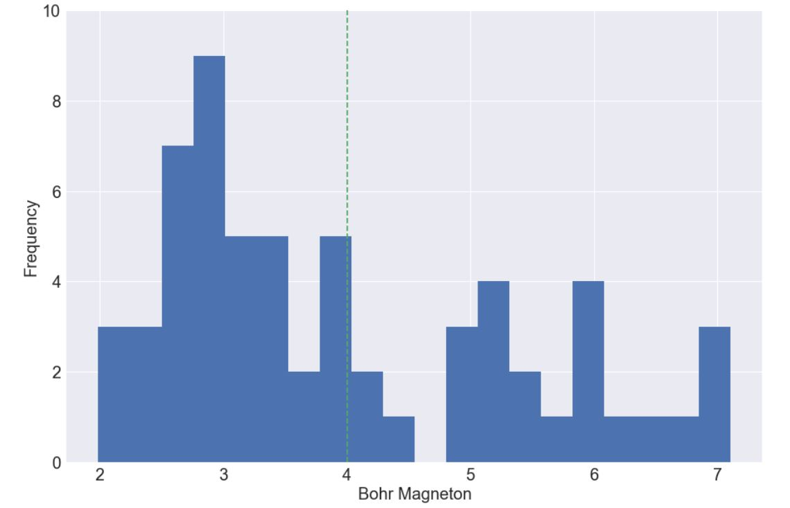
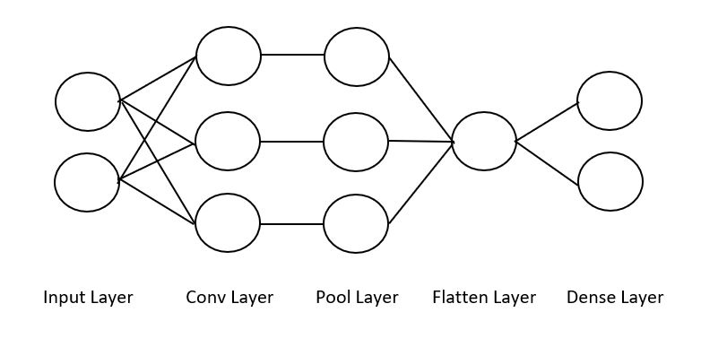
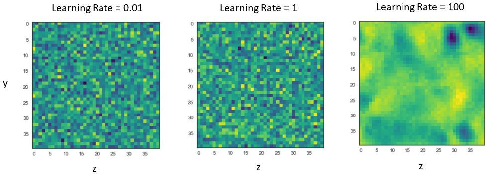

# Using convolutional neural networks to understand magnetism in two-dimensional ferromagnetic structures based on Cr2Ge2Te6

## Introduction

Over the past decade, two-dimensional materials have demonstrated immense potential for creating advances in fundamental research and industrial applications. In particular, experimental and computational studies of the transition-metal based compounds [1,2] both highlight the emergence of numerous magnetic phases in two-dimensional crystals. These findings have sparked significant excitement in materials science for their potential use in data storage and spintronics applications. A notable example of this is Cr2Ge2Te6 which was recently experimentally shown to exhibit ferromagnetism [3]. Despite these experimental observations and our general understanding of how magnetism arises in bulk crystals, we have yet to fully understand the specific mechanisms through which magnetism arises in these two-dimensional (2-D) materials. Developing this understanding could significantly impact (1), our ability to predict the properties of novel materials - new materials which are designed by decorating atomic sites of known 2-D structures with different atoms [fig 1] and (2), our ability to engineer materials for specific device applications. 

 

Figure 1. Monolayer structure of a Transition Metal Dichalcogenide in the 2H phase where yellow spheres represent chalcogens and blakc spheres represent metals. By decorating these lattice sites with different atoms from the periodic table, we can develop a large space of testable '2-D' materials (adapted from Qing Hua Wang et al [4]) 

For many years research groups have focused on improving density functional theory (DFT) calculations to capture such properties [5,6]. Yet these methods tend to be computationally and financially costly. Machine learning (ML) is rapidly paving the way to accurate property predictions in a much faster and cost-effective manner [7]. In addition, ML tools create avenues through which we can develop a better understanding of the properties themselves. For example, Pilania et.al have shown that machine learning methods can be used to accurately model bandgaps of double perovskites [8]. Furthermore, ML methods have also been shown to capture an understanding of the underlying physics in layers of a Neural Network trained to reproduce DFT results [9,10]. Given this, we decided to build a convolutional neural network architecture to develop a better understanding of magnetism in transition metal trichalcogenides( see fig2). Our preliminary results indicate that our model can capture large patterns linked to fluctuations in spin density across lattice sites. However, the microscopic origins of magnetism in these density profiles have not been identified yet through this approach.

 

Figure 2. ABX3 structure of a transition metal trichalcogenide. 'A' sites represent Transition Metals, 'B' sites typically represent group 4 and 5 atoms and 'X' sites represent the chalcogens (group 6). 

## Background

### Magnetism

Our choice of algorithm and data to address this challenge was governed by our current understanding of magnetism. We know that magnetism in materials arises because of the quantum nature of electrons [9]. Specifically, we know that the net magnetic moment (J) of a single atom is:

 
J=L±S

Where L is the orbital angular momentum of the electron around the nucleus and S is the intrinsic spin angular momentum of the electron. When many atoms are placed next to each other in a crystalline structure, it is possible for electrons in the atomic orbitals to overlap and adhere to the Pauli exclusion principle (which states that two or more identical fermions cannot occupy the same quantum state within a quantum system). As a consequence, the spins can order in a particular manner, for instance they can align in either parallel or anti-parallel configurations. These spin orderings can be modeled using the Heisenberg model. It assumes that the dominant coupling between two dipoles may cause nearest-neighbors to have lowest energy when they are aligned. This results in a Hamiltonian on a honeycomb lattice where:

 

In which σi is the spin of one of the atomic electrons and J1 is the interaction term that tells us how the spins of nearest neighbor atoms interact. In general, additional interactions between other atomic sites are neglected because the J1 interaction is dominant in bulk crystals. This was also assumed to be the case in 2-D materials until Sivadas et al  showed that by adding J2 and J3 interaction terms into the Hamiltonian for 2-D materials (second and third nearest neighbor interactions), they were able to obtain results that agreed better with experiment [10]. Their resulting Heisenberg model is:

 

Furthermore, they visually illustrate [FIG x] how these interactions could take place.

 

Figure x.3 pathways presented for Nearest Neighbor exchange. a) represents the second nearest neighbor, b) the third and c) the first (direct exchange-vertical and superexchange- 87.9 angle). 

These results inspired us to ask the following question: can we find evidence of exchange interactions (patterns) by analyzing the spin density profiles (images) of 2-D materials? One natural approach for this was to use a convolutional neural network (CNN). 

### Convolutional Neural Networks

A Convolutional Neural Network is an ML algorithm which takes images as inputs and then convolves these images with 'filters' to produce outputs which can be pooled/flattened or used to make a decision. An example architecture is highlighted in fig x.

 

Figx. Left: A regular 3-layer Neural Network. Right: A convolutional net arranges its neurons in three dimensions, as visualized in one of the layers. Every layer of a CNN transforms the 3-D input volume to a 3-D output volume of neuron activationss. In this example, the red input layer holds the image, so itds width and height would be the dimensions of the image and the depth would be 3 (Red,Green,Blue channels). Note: We can add an additional dimension for 4-D information (e.g. figures in x,y and z with a channels parameter) 

CNN’s have been used quite successfully for pattern recognition in images. For example, CNN’s trained on human faces were shown to detect facial characteristics within their filters [CITE]. Given this, we thought CNN’s would be a great way to detect patterns (exchange interactions) in large images (electron density profiles).

## Methodology

### Data 
We used DFT to build a database of structures based on Cr2Ge2Te6. Our motivation in doing so was to replace the individual sites by different atoms so that we could obtain variations in the magnetic densities and order for training the ML model. We did this by replacing one of two chromium atoms (A sites) in unit cells with a transition metal. We restricted the transition metals to (Ti,V,Cr,Mn,Fe,Co,Ni,Cu,Y,Nb,Ru) in order to comprise most of the first row of TM’s and a few of the second. Substitutions for B were Ge,Ge0.5Si0.5,Ge0.5P0.5,Si and P. X sites were decorated with S, Se or Te. (Alternatively, see the table x).
	
<table align = "center">
	<tr>
		<td> Site</td>
		<td> Element </td>
	</tr>
	<tr>
		<td>A</td>
		<td>Ti,V,Cr,Mn,Fe,Co,Ni,Cu,Y,Nb,Ru</td>
	</tr>
	<tr>
		<td>B</td>
		<td>Ge,Ge0.5Si0.5,Ge0.5P0.5,Si,P </td>
	</tr>
	<tr>
		<td>X</td>
		<td>S,Se,Te</td>
	</tr>
</table>
	
For each composite, DFT total energies of the relaxed structures were calculated for several initial spin configurations: non-spin polarized, ferromagnetic and Neel antiferromagnetic. The resultant spin density profiles (60X60X120 images [FIG x]) contain information relevent to magnetism and thus served as input to our ML models. 

 

Figx. Left: unit cell of Cr2Ge2Te6 (in the x-y plane) with spin density isosurfaces overlaid at charge values of 7.3e-5. The yellow surfaces are positive densities and the blue are negative. Blue spheres represent Chromium sites, purple spheres represent Germanium and yellow sphere represent Tellerium. Right: average projection of charge densities in the x-y plane.  

To begin our investigation, we used the FM spin configuration which comprise mixing of all the A and B sites shown in Table x with X = Te. We also needed a target (response) variable and decided to use magnetic moment as a means for classification. For our initial model we chose 4 Bohr magnetons (the median of our distribution) as a splitting criterion for training a classification model (see fig x). Note, our 3-D charge densities are handled easily by the python Neural Network packages, keras and tensorflow. 
 

 

Distribution of response variables appears to illustrate mixture of two gaussians. As such, we use the mean, highlighted in green, as the splitting criteria which leads to 37 values below 4 Bohr magnetons and 25 above.  

### Architecture Design

One big challenge with using Convolutional Neural Networks is that they have many parameters and can be quite complex. To tackle this problem in a systematic way we decided to think more closely about what convolutions were doing to our input image and what we were hoping to extract. Here we outline some of our preliminary design decisions:
1. We wanted to start out with a simple model and then tune parameters accordingly. As such, we decided our model would simply have one convolutional layer, one pooling layer and one flatten/dense layer. 
2. Since we were hoping to find 3 nearest neighbor exchange interactions, we designed our first convolutional layer to have 3 filters. We later varied the number of filters to get a sense for the kind of variations in patterns recognized (see results).
3. A large kernel size of (40X40X40) was initially chosen because this would force the CNN filters to learn larger atomic-distance patterns. It must be noted that smaller kernels underfit because of significant data compression and larger kernels overfit due to no compression. As such one needs to cross validate to find the right size with the constraint here that they shouldn’t be too small since this could result in a non-interpretable model.
4. Our model is looking for nearest neighbor exchange patterns which occur on length scales the order of atomic distances. Therefore, we used a 2X2 supercell to create the spin density profiles.Thus, filters could scan over and detect these ‘long’ range interactions.
5. Strides for the convolutional layers were varied across experimental runs because we had little prior knowledge for what they should be set at. We do know that small strides mean more information encoded in our layers, but this also means more computation. Accounting for this trade-off we tried numerous strides to see whether they would influence performance.
6. A relu activation unit was used to prevent the zeroing out of filter weights.
7. A pool size of (2X2X2) was chosen so that additional convolutional layers could be added later since larger pool sizes mean significant shrinkage.
8. A flatten layer was used with a dense layer of size 2 and a softmax for classification since there are only 2 categories.
9. We decided to use stochastic gradient descent (SGD) since it prevents us from getting stuck in local minima. A learning rate which determines the rate at which we try to find minima was set and then varied across the trials to determine the best rate in our validation set. The choice of batch size (number of datapoints to find an SGD gradient on) significantly affects our ability to get to the local minima but large batch sizes tend to be memory intensive. 
10. Most convolutional nets have a channels parameter which is usually meant to reflect different colors (e.g.  rgb) or different types of the same image. Our spin densities naturally fit into the black and white color scheme since some densities were negative and others were positive. We therefore divided the data accordingly. A train test split of 70-30% was used and 5 Epochs were run.

### Computation and Memory
Convolutional Networks require significant computation and memory to run. While our initial model was simple, it ran in about 15 minutes on a new i-7 laptop. Scaling such a problem to higher dimensions was clearly going to be an issue from that perspective. Furthermore, the memory requirements for such a framework are governed by the number of weights needed for each filter and the actual output of the filters. A class at Stanford details how to do the memory calculation and we carried it out for our own system, see the benchmarking excel sheet on github. From this analysis it was clear that although we needed roughly 500mb for our architecture, extra system memory on a cluster meant that we needed > 2Gb. With this, we converted our system to use two GPU's for both training and evaluation, this brought down our system run times drastically and helped us scale our problem. For reference, a simple architecture which ran one epoch took 7 minutes on a relatively new computer and took 8 seconds on a single GPU.

## Results

Since these are only our preliminary results, we segment them according to the various parameters we swept over. To do this we needed to define a base model. Using the parameters discussed previously we use the following as our base model:

 

With the given parameters, we swept over multiple filters and filter sizes to search for a model with a high validation accuracy and features that showed patterns. We realized that the most interpretable features were extractable at larger learning rates and we can see this here:

 

| Tables        | Are           | Cool  |
| ------------- |:-------------:| -----:|
| col 3 is      | right-aligned | $1600 |
| col 2 is      | centered      |   $12 |
| zebra stripes | are neat      |    $1 |

 
Fig X. The figures illustrate the first filter averaged along the x dimension from three different models in which the left most one had a learning rate of 0.01, the middle had 1 and the right one had 100. The table shows training and validation accuracies for the first and last epoch for each model.

Given that a high learning rate led to good accuracies and an interpretable filter, we ran numerous test which we hihglight below.

### Varying # of kernels

Accuracy/Epoch	Number of Filters
	2	3	4
Training/ 1	0.5349	0.6047	0.5349
Validation/ 1	0.5789	0.5789	0.4211
Training/ 5	0.6047	0.6047	0.3953
Validation/ 5	0.5789	0.5789	0.4211

### Varying pool size

Accuracy/Epoch	Pool Size
	1	2	3
Training/ 1	0.5349	0.6047	0.6977
Validation/ 1	0.5789	0.5789	0.5789
Training/ 5	0.6047	0.6047	0.6047
Validation/ 5	0.5789	0.5789	0.5789

### Varying learning rate 

Accuracy/Epoch	SGD LR
	1	100	10000
Training/ 1	0.5814	0.6047	0.6047
Validation/ 1	0.5789	0.5789	0.5789
Training/ 5	0.6047	0.6047	0.6047
Validation/ 5	0.5789	0.5789	0.5789

From these results we can see that 3 filters with a pool size of 2 and learning rate of 100 do a decent job in terms of validation accuracy within the first epoch. Furthermore, the filters in this configuration (all the middle figures) illustrate a recognizable pattern in the top right corner. However, further tuning the kernel size and other parameters could significantly influence the resultant image as we have seen in the figures above. The sensitivity to these changes might stem from the little data we have and it will be useful to expand our training from the 66 datapoints to a larger set. In addition, it might be crucial to rethink our binary response variable. Perhaps we should make this a multi-class classification problem.

## Future Investigation

## Conclusion

While ML methods have rapidly gained attention over the past few years as a novel set of tools to solve high dimensional problems, applying them to specific problems involves a significant amount of care and attention to detail. As we have shown, attempting to extract information from charge density profiles using convolutional nets involves tuning numerous parameters and checking how performance and filters change. In doing so we found a high level of sensitivity in response to changes in parameters but we were also able to demonstrate that filters can extract some macro level information from the charge profiles. This only marks one part of the challenge, the other being one of computational/memory cost. As the problem got bigger we needed to use high performance computing (e.g. GPUs) and while this did speed up our calculations, increasing certain parameters such as the number of convolutional layers dramatically slowed down computations and added memory cost. With that said, there does appear to be some underlying physics captured in the filters, it simply requires the right amount of tuning and more data to ensure predictable results.

## References
https://www.earth.ox.ac.uk/~conallm/Phys-princip.pps
[1] M.A. McGuire, H. Dixit, V.R. Cooper, and B. C. Sales, Chem.Mater. 27, 612 (2015)
[2] Y. Takano, N. Arai, A. Arai, Y. Takahashi, K. Takase, and K. Sekizawa, J. Magn. Magn. Mater. 272, E593 (2004)
[3] Gong. Cheng, Li. Lin, Li. Zhenglu et al, Nature 546, 265-269 (2017)
[4] Shi. Xinying, Huang. Zhongjia, Huttula, Marko, Li. Taohai, Li. Suya, Wang. Xiao, Luo. Youhua, Zhang. Meng, Cao. Wei, MDPI. Crystals 8(1), 24 (2018)
[5] Li. Jiao, Fan. Xinyu, Wei. Yanpei, and Chen. Gang. Nature Sci. Rep. 6, 31840 (2016)
[6] Hegde. Ganesh, and B. R. Chris. Nature Sci. Rep. 7, 42669 (2017)
[7] Pilania. G, A. Mannodi-Kanakkithodi, B.P. Uberuagu, R. Ramprasad, J.E.Gubernatis, and T. Lookman. Nature Sci.Rep. 6, 19375 (2016)
[8] E.D. Cubuk, M.D. Brad, O. Berk, W. Amos, E. Kaxiras. J. Chem. Phys. 147, 024104 (2017)
[9] J. M. D. Coey. Cambridge Press. 9780521816144 (2009)
[10] N. Sivadas, M.W. Daniels, R.H.Swendsen,S.Okamoto, and D.Xiao. J. Phys. Rev. B. 91, 235425 (2015)

The code in this repo allows you to run a Convolutional Neural Network with 3D charge density profiles as input. The code is configured to run both locally and on Harvard FAS RC GPU's.

<b>Workflow</b>

1. Pull all composite DFT calculations into one folder using chgcar.py when collecting data from the supercomputer that runs DFT calcs.
2. Run magdensity splitter on CHGCAR files to split (spin up + spin down) from (spin up - spin down) and store the latter in a magnetic densities folder.
3. Run the scraper notebook to save the magnetic densities and response variable (magnetic moment) into a large dataframe.
4. To run the convolution locally use the notebook, it basically configures a simple 2/3D convolution of the inputs and is a great way to test whether you have the right files. Make sure the convolutions have small filter sizes (e.g. 5,5,5) since larger weights require a lot of memory and CPU's aren't good for this. 
5. You can play with the architecture and will soon realize the code runs very slowly (especially if using Conv3D), as such we need to run this on GPU's:

<i>Instructions to get setup using a GPU</i>

Read through the evernote on GPU's in Odyssey (v2.0). The quickest way to setup is to initially just use CNN.py and folow the instructions to create a conda environment and install keras in it as well as load modules. Initially the file you will need is tester.py which is a CNN that runs on the MNIST dataset. You will have to use srun to run the code or you can create a small sbatch file to run it.

Only once the above works can you move forward!
You should now be ready to run our CNN. Configure the CNN in CNN.py to your liking and download a file called chgd_input which is linked here: https://www.dropbox.com/s/iquhjkpvhz7c7g6/chgdf_input?dl=0 into the same directory into your local node on Odyssey. Also download cnn.batch and configure the filenames you want to store. Once done, simply run <sbatch cnn.batch>. The great thing about sbatch is that you can edit your file, run an sbatch, and then repeat. It allows you to change variables in your local node and send jobs with the new parameters to worker nodes.

Once all of this works, use cnn_largep.py and cnn_largep.batch which will run a supercell and do everything on 2 GPU's. edit cnn_largep.py when you want to change filters etc.

See the benchmarking excel sheet of the different configurations already run and results I can provide. Seems like larger learning rates are better.

6. After running your code, you can copy the h5 file output into your local machine and run visualizer.ipynb which will let you see projections of your filter.

<b>Notes on Architecture</b>

- The point of running this model is to be able to capture patterns such as Nearest Neighbor exchange in filters. Note that Sivadas et al show that these occur on the order of atomic lengths which means we should probably scale our unit cell to a supercell (done in cnn_largep.py in function matmul) as well as increase our filter sizes to greater than 60 in each dimension.
- We need to think carefully about the classification model we are building. At present, we are classifying composites as 1's if they have a bohr magneton > 4. However, this cutoff was determined using a histogram.
- At present we believe we should have 3 filters because this is consistent with Sivadas et al and the number of patterns they present, however, it might be the case that more are needed to capture superexchange.
- Need to figure out how to get granularity.
- Need to understand why a large learning rate yields a more interpretable pattern.
- Need more datab

